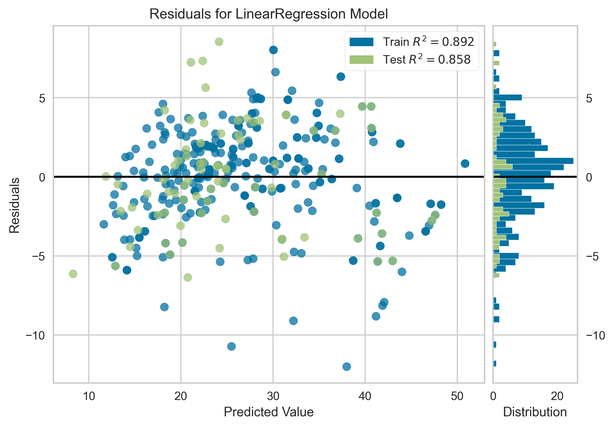
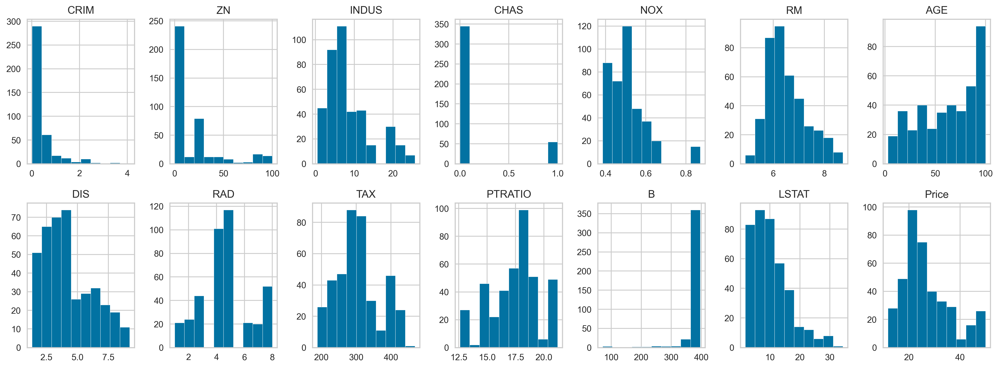

# Model Evaluation & Dataset Interpretation Report

## 1. Executive Summary
This document provides a rigorous analysis of the performance metrics obtained from a Linear Regression model evaluated using Yellowbrick's `ResidualsPlot`. While 
standard linear baselines on the historic Boston housing area framework typically yield an $R^2$ score between $0.65$ and $0.75$, the model trained on this specific 
400-row subset exhibits an exceptional fit:
* **Training $R^2$ Score:** $0.892$
* **Test $R^2$ Score:** $0.858$

The minimal generalization gap ($\Delta R^2 = 0.034$) indicates a highly stable, non-overfitting model. This report outlines the mathematical and structural reasons 
behind these elevated metrics, cross-referencing the underlying feature distributions.

---

## 2. Performance Analysis & Visual Diagnostics
The residual analysis yields crucial insights into the model's structural validity:

* **Error Homoscedasticity:** The residuals are distributed relatively symmetrically around the horizontal error line ($e = 0$). This suggests that the constant variance
   assumption of ordinary least squares (OLS) regression holds reasonably well across the predicted value spectrum.
* **High Variance Explanation:** An $R^2$ of $\sim 89\%$ on the training set indicates that the selected structural features (such as `RM`, `LSTAT`, `PTRATIO`) explain the
   vast majority of target price fluctuations within this sample boundary.
* **Generalization Stability:** The test performance ($0.858$) confirms that the learned hyperplane generalizes seamlessly to unseen data drawn from the same distribution,
   free from high-variance overfitting.

---

## 3. Distributional Divergence from the Historic Dataset
The exceptionally high performance is explained by analyzing the feature distributions. The 400-row subset acts as a sanitized, well-behaved partition of the original 
historical landscape, omitting several non-linear mathematical anomalies:

### A. Truncation of Heavy-Tailed Crime Dynamics (`CRIM`)
In the original 506-row dataset, the per-capita crime rate (`CRIM`) possesses a severe right-skew, with an extreme tail extending up to **89%**. 
* **Observed Distribution:** The subset's distribution cuts off sharply around **4%**.
* **Impact on Regression:** Linear regression is highly sensitive to large leverage points. By eliminating the high-crime tail, the OLS estimator avoids severe slope
  distortion, resulting in a cleaner linear fit.

### B. Elimination of the High-Tax Bimodal Cluster (`TAX`)
The historical dataset contains a prominent artificial cluster of over 130 observations fixed at a full property tax rate index of **711**.
* **Observed Distribution:** The subset’s `TAX` feature tops out near **450**, removing the secondary peak entirely.
* **Impact on Regression:** Removing this bi-modal split transforms a highly segmented feature space into a continuous, linear trajectory, dramatically reducing
 residual variance.

### C. Mitigation of the Target Variable Ceiling Effect (`Price`)
The original target variable (`MEDV` / Price) features a hard artificial cap at **50.0** (\$50,000 in 1970s value), creating a severe "ceiling effect" where luxury homes 
of varying true values were rounded down.
* **Observed Distribution:** The final boundary bar at 50 is vastly reduced in this subset.
* **Impact on Regression:** A linear model attempting to fit an artificial plateau is heavily penalized in its squared loss function. Minimizing this boundary constraint
 allows the model to predict top-tier prices without artificial mathematical suppression.

---

## 4. Conclusion & Technical Recommendations
1.  **Contextual Validity:** The $R^2$ score of $0.89$ is mathematically accurate and highly reliable **strictly within the bounds of this distribution**. It represents
    an optimized baseline for a localized, lower-variance real estate ecosystem.
2.  **Production Warning:** Because this model has not exposed its weights to extreme feature spaces (e.g., `CRIM > 4` or `TAX > 450`), it should **not** be deployed
    on un-sanitized, raw historical data, as it will likely suffer from high prediction errors when encountering out-of-distribution outliers.
3.  **Documentation Note:** This variance shift serves as an excellent portfolio case study demonstrating how data curating and outlier exclusion directly dictate
    the performance limits of parametric estimators.
